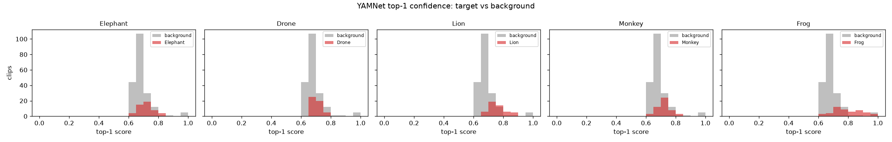

# L1 — YAMNet Baseline Scores

**plan.md leg:** "Yamnet Baseline Scores". **Goal:** see what raw (un-fine-tuned) YAMNet already
thinks about our sounds. **Script:** `experiments/scripts/leg1_baseline.py` (reads the cache from
`extract_yamnet.py`). **Artifacts:** `experiments/outputs/baseline_topk.csv`,
`baseline_summary.json`, `figures/baseline_top1_hist.png`.

## Method

Ran the project's **custom mel-patch YAMNet** (`yamnet/export_out/tf2`, 521 AudioSet classes) on
all 450 clips. This is the same model ODAS calls on-device — it takes 96×64 log-mel patches
derived from the 257-bin spectra (front-end: STFT 400/160/512 → 64 mel 125–7500 Hz → log → 96×48
patches, matching `data_loader.py` and the C wrapper). For each clip we mean-pool the per-patch
scores and take the top-5 AudioSet classes.

## Finding: raw YAMNet does **not** recognize our classes

| class | most common top-1 | sensible? | mean top-1 score | % clips w/ relevant class in top-5 |
|---|---|---|---|---|
| Elephant | Jackhammer (8/50) | ❌ | 0.72 | 12% |
| Drone | Jackhammer (13/50) | ❌ | 0.70 | 0% |
| Lion | Cupboard open/close (16/50) | ❌ | 0.76 | 2% |
| Monkey | Rail transport (4/50) | ❌ | 0.72 | 2% |
| Frog | Eruption (8/50) | ❌ | 0.80 | 0% |

The top-1 predictions are **acoustically adjacent but wrong**: elephant rumble → *Jackhammer*,
drone motor → *Jackhammer*, frog chorus → *Eruption*. Almost nothing lands on an animal/relevant
AudioSet class.

The histogram shows target and background clips both cluster at mid-high top-1 confidence
(0.6–0.8) on these wrong classes — so **raw top-1 confidence does not separate target from
background.** The 521-class head is uncalibrated for this domain.

## Interpretation (per plan.md's key insight)

> *"If YAMNet already scores elephant clips high on Animal/Elephant — your job is easier. If it
> scores them high on Music — the embedding space needs work."*

Here the *head* is useless out-of-the-box, but the next leg ([`L2`](L2_embedding_viz.md)/
[`L3`](L3_linear_probe.md)) shows the *embedding space* is excellent. So the job is **easy**: a
lightweight probe / fine-tuned head recovers the classes — no backbone surgery needed. This is
the direct empirical motivation for the fine-tuning program in `experiments.pdf` (Phase 2).

**Pass criterion** ("you understand what YAMNet already knows"): ✅ — it knows essentially nothing
at the label level for these classes, which is itself the actionable result.
