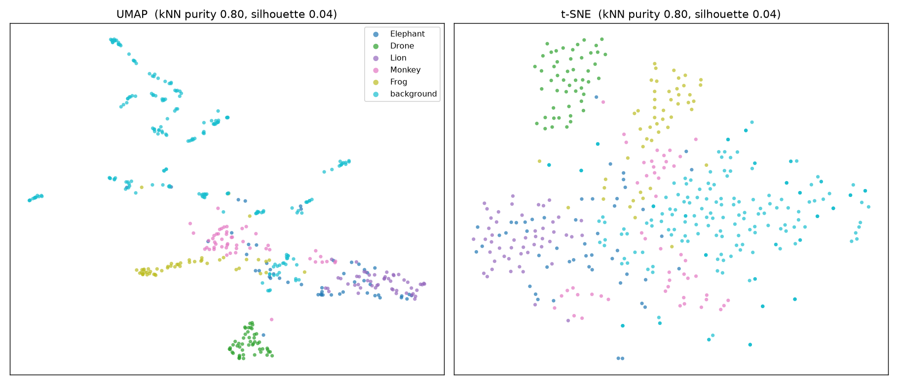

# L2 — Embedding Visualization

**plan.md leg:** "Embedding Visualization". **Goal:** visually confirm target sounds cluster in
YAMNet's 1024-d embedding space. **Script:** `experiments/scripts/leg2_embeddings.py`.
**Artifacts:** `figures/embeddings_2d.png`, `experiments/outputs/embedding_separation.json`.

## Method

Took the 1024-d mean-pooled YAMNet embeddings for all 450 clips, standardized, and projected to
2-D with both **UMAP** and **t-SNE**. Colored by class. Added two quantitative separation metrics
so the read isn't purely visual:
- **k=10 NN label purity** = average fraction of a clip's 10 nearest neighbours sharing its label.
- **silhouette** over the 6 labels.

## Finding: clear clustering, with Elephant the exception

- **kNN purity = 0.80**, silhouette = 0.04. (Silhouette is low because *background* is a diffuse,
  multi-modal cloud that surrounds the targets — expected for diverse ambient; purity is the more
  meaningful number here and it's high.)
- **Drone** forms a tight, isolated cluster; **Lion** is a clean separate band; **Frog** and
  **Monkey** form adjacent compact clusters.
- **Elephant overlaps the background cloud** — its low-frequency rumble sits near ambient energy.
  This is the one partially-entangled class and predicts its weaker probe score in
  [`L3`](L3_linear_probe.md).
- **Background** is spread out (many sub-types of ambient), not a single blob — useful, because it
  means hard-negative ambient events live near the targets and will need the model's attention
  (cf. `experiments.pdf` EXP-B4 hard negatives).

**Pass criterion** ("at least partial separation visible; flag early if clusters heavily overlap
background → Level-3 fine-tuning needed"): ✅ — strong separation for 4/5 classes; only Elephant
partially overlaps background. No backbone fine-tuning is forced by this leg; a head is enough.
