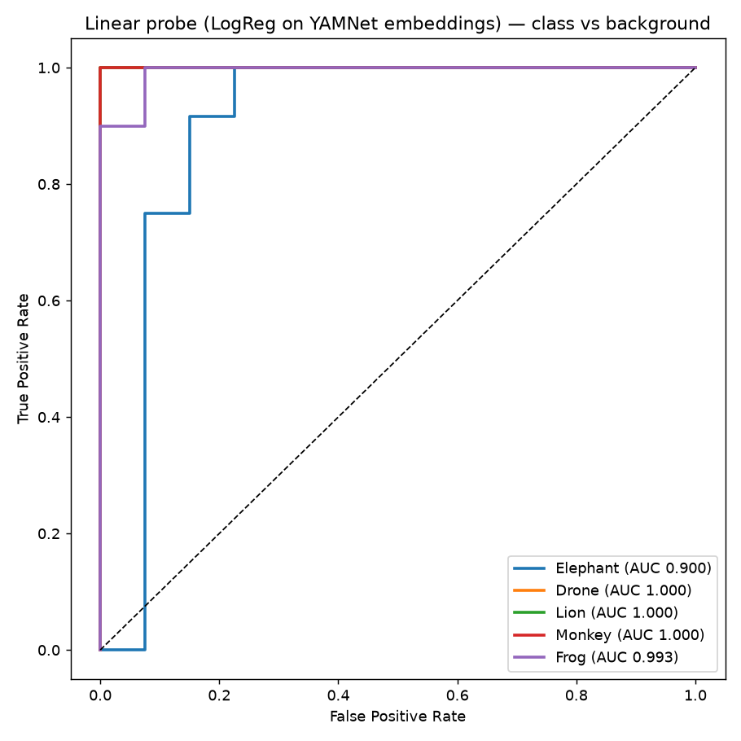

# L3 — Linear Probe (Logistic Regression)

**plan.md leg:** "Simple Classifier: Linear Probe". **Goal:** the ceiling for a frozen backbone
with zero complexity. **Model:** YAMNet (frozen) → mean-pool → LogisticRegression, one binary
classifier per class vs background. **Script:** `experiments/scripts/leg3_linear_probe.py`.
**Artifacts:** `figures/roc_linear_probe.png`, `experiments/outputs/leg3_linear_probe.json`.

## Method

Per target class: standardize embeddings, fit `LogisticRegression(class_weight='balanced')` on
the **train** split, evaluate on the **test** split. Splits are the source-level 80/20 from
[`01_data_prep.md`](01_data_prep.md) (no window leakage). Background is the negative for every
class.

## Finding: near-perfect, linearly separable (Elephant the only soft spot)

| class | AUC | Acc | Precision | Recall | F1 | pass (AUC>0.70) |
|---|---|---|---|---|---|---|
| Elephant | 0.900 | 0.846 | 0.625 | 0.833 | 0.714 | ✅ |
| Drone | 1.000 | 1.000 | 1.000 | 1.000 | 1.000 | ✅ |
| Lion | 1.000 | 1.000 | 1.000 | 1.000 | 1.000 | ✅ |
| Monkey | 1.000 | 1.000 | 1.000 | 1.000 | 1.000 | ✅ |
| Frog | 0.993 | 0.980 | 1.000 | 0.900 | 0.947 | ✅ |

- **All five PASS** the AUC > 0.70 criterion, four of them at/near 1.0.
- **Elephant** is the weakest: AUC 0.90 with **precision 0.625** — it recalls elephants well
  (0.83) but picks up background false positives, exactly the embedding overlap seen in
  [`L2`](L2_embedding_viz.md).
- This ROC is the **canonical baseline** every later experiment is compared against; ROC points
  are saved in `leg3_linear_probe.json` for overlaying.

## Interpretation

A plain linear classifier on frozen YAMNet embeddings is essentially at ceiling. The embedding
space is **not** the bottleneck (refuting any need for backbone surgery on this clean data). The
only headroom is Elephant-vs-background precision, which is a *data/feature separability* issue
(low-freq rumble ≈ ambient), not a model-capacity one.

**Pass criterion** (AUC > 0.70): ✅ all classes. Embedding space confirmed correct.

> ⚠️ **Caveat for the bigger plan:** these are clean library clips. The `experiments.pdf` program
> trains/evaluates on **post-ODAS** reconstructed spectra (beamformed, Griffin-Lim artefacts,
> ghost-track false positives) — much harder. This near-perfect probe is the *upper bound*, not a
> deployment estimate.
