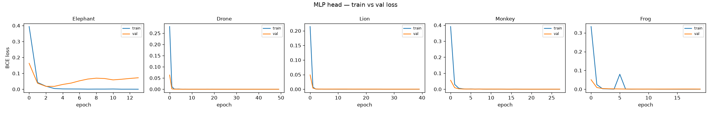
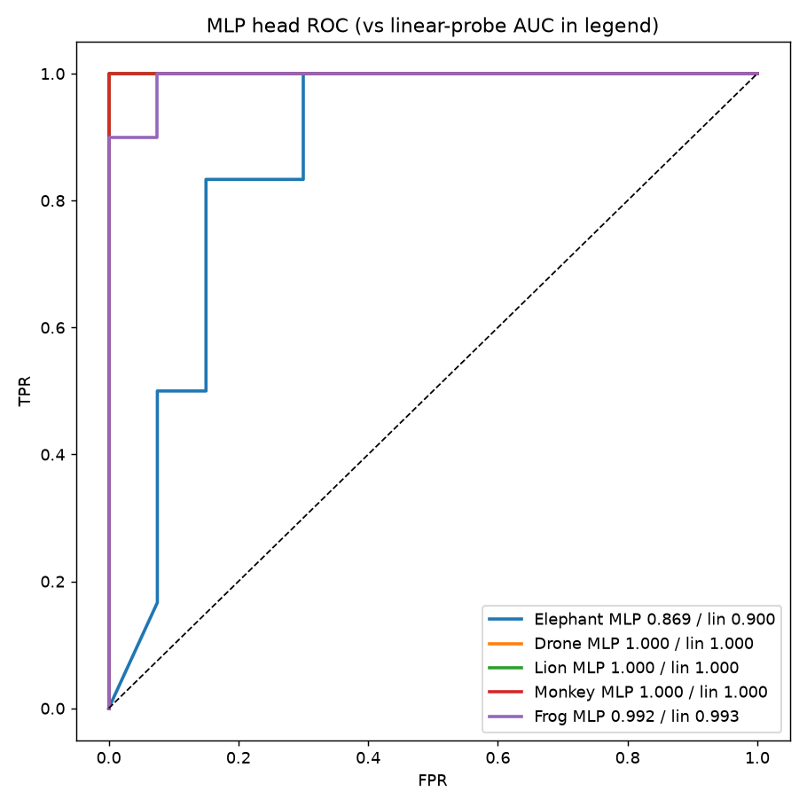

# L4 — Small MLP Head

**plan.md leg:** "Small MLP Head". **Goal:** does non-linearity beat logistic regression?
**Model:** YAMNet (frozen) → mean-pool → MLP(1024→256→128→1, sigmoid), Adam lr=1e-3, BCE, 50
epochs, early stopping on val loss (patience=10). **Script:** `experiments/scripts/leg4_mlp_head.py`.
**Artifacts:** `figures/mlp_loss_curves.png`, `figures/roc_mlp_head.png`,
`experiments/outputs/leg4_mlp_head.json`.

## Finding: the MLP does **not** beat the linear probe

| class | MLP AUC | linear AUC | Δ | improves >2%? |
|---|---|---|---|---|
| Elephant | 0.869 | 0.900 | −0.031 | no |
| Drone | 1.000 | 1.000 | 0.000 | no |
| Lion | 1.000 | 1.000 | 0.000 | no |
| Monkey | 1.000 | 1.000 | 0.000 | no |
| Frog | 0.992 | 0.993 | −0.001 | no |

The loss curves explain why:
- **Drone / Lion / Monkey / Frog** — train and val loss collapse to ~0 within a few epochs; the
  problem is already solved linearly, so the MLP just memorizes the same boundary.
- **Elephant** — **textbook overfitting**: train loss → 0 while **val loss rises after ~epoch 3**.
  Early stopping restored best weights, but the MLP still ends *below* the linear probe (0.869 vs
  0.900). With ~40 train clips and an entangled class, the extra capacity hurts.

## Interpretation (per plan.md)

> *"If AUC doesn't improve by >2%: the gain isn't worth the complexity — the problem is the
> features, not the head."*

Confirmed. Non-linearity adds nothing because frozen YAMNet embeddings are already linearly
separable for these classes. **Stick with the linear probe** as the lightweight baseline; spend
effort on *features/data* (post-ODAS realism, hard negatives, more Elephant separation) — which
is precisely what `experiments.pdf` Phase 1–2 do — not on a fancier head.

**Pass criterion** (AUC improves >2%): ❌ for all classes — and that's the informative result, not
a failure.
