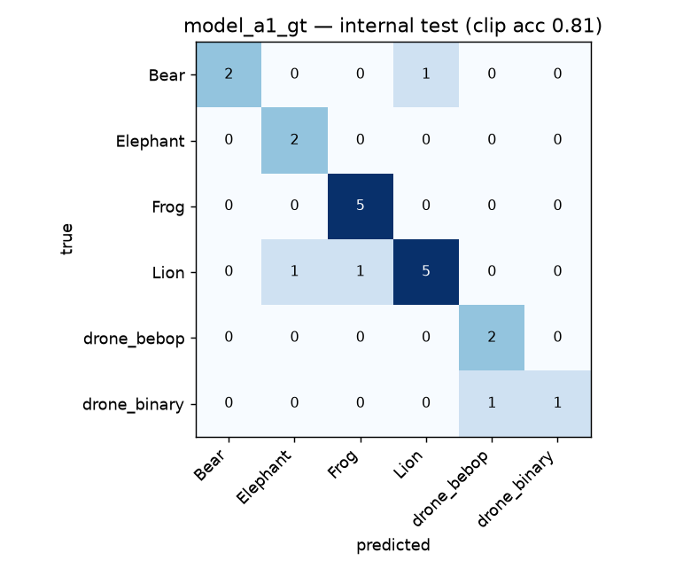

# Phase 1 · EXP-A1 — Baseline: No Ambient (Track A, ODAS-free)

**experiments.pdf tag:** `exp_a1_no_ambient`. **Question (Phase 1):** does ambient type drive
ODAS false positives, and does matched-ambient training help? EXP-A1 is the **noise-floor
baseline** — directional sources only, no ambient.

**Scope of this run — Track A (ODAS-free):** produced `model_a1_gt` (the GT-trained arm) entirely
on this Mac: scene → render → GT clips → frozen-YAMNet head → clip accuracy. The **post-ODAS arm
(`model_a1_odas`) and the FP/min metric require the `odaslive` binary (Track B)** and are deferred
to a Linux/Pi env — see [Status & deferred](#status--deferred).

## What ran

| Step | Tool | Output |
|---|---|---|
| Scene (6 labels, 600 s, dist 10–150 m, **0 ambient**) | `expA1_render.py` (headless `renderer.py`) | 90 directional sources, `.raw` + 90 `.f32` GT sidecars |
| GT clip dataset (3 s win, 1.5 s hop, source-level split) | `expA1_build_dataset.py` (`gt_dataset_builder.py`) | `gt_a1_no_ambient`: 133 clips, 6 labels |
| Holdout (300 s, seed 99) | same, `--name exp_a1_holdout` | `gt_a1_holdout`: 111 clips |
| `model_a1_gt` (frozen YAMNet + 256→128→softmax head) | `expA1_train_gt.py` | clip-acc + confusion |

Fixed protocol honored: room 250×250×20, absorption 0.7, max_order 3, ReSpeaker 4-mic geometry,
16 kHz. Labels: Elephant, Bear, Frog, Lion, drone_bebop, drone_binary.

## Result

| Metric | Value |
|---|---|
| Internal test clip accuracy | **0.71–0.81** (21-clip fold, run-to-run variance) |
| **Holdout-render clip accuracy** | **0.60** |
| Holdout per-class F1 | Elephant 0.84, Frog 0.84, drone_binary 0.48, Lion 0.45, Bear 0.38, drone_bebop 0.35 |



## Findings

- **A clean baseline exists and the chain works end-to-end** on this Mac (render → GT dataset →
  trained model → eval), with real artifacts under `experiments/sim/`.
- **~20 pt generalization drop** from internal test (0.81) to a separate holdout render (0.60),
  *even with no ambient and clean GT audio*. The gap is driven by **Bear, drone_bebop, Lion,
  drone_binary**; **Elephant and Frog** hold up (≈0.84). This matches the PDF's observation that
  short/quiet events (Bear) are disproportionately hard, and tells us the floor is set by
  intra-class acoustic variability + tiny per-class counts, before ODAS even enters.
- **Drone sub-types confuse each other** (drone_binary↔drone_bebop) — expected, since both are
  motor/rotor spectra; per-class thresholds (Phase 3 C2) will matter here.

## Caveats

- **Small dataset** (133 train / 111 holdout clips). The instance counts were modest to keep
  renders fast; the headline number is the *holdout* (comparable across experiments), and the
  internal-test figure is noisy. Scale `--instances` for tighter numbers.
- **Track A ≠ full deployment metric.** EXP-A1's headline metric in the PDF is **FP/min ≤ 2**,
  which is intrinsically an ODAS-detection metric (detections during quiet periods). It cannot be
  computed without `odaslive`. Track A gives clip accuracy only.
- **Head, not full 2-phase finetune.** This run uses the frozen-backbone Phase-1 head. The upstream
  `train_yamnet.py` Phase-2 (top-4 backbone unfreeze) currently breaks rebuilding the backbone from
  the `tensorflow/models` layer-defs (Keras-version / `_YAMNET_LAYER_DEFS` calling-convention
  mismatch vs current `master`). The GT-vs-ODAS comparison the experiments test is **unaffected**
  — the variable is the training *data*, and both arms use the identical head procedure — but the
  exact deployable TFLite needs the pinned `tensorflow/models` commit in the Linux env.

## Status & deferred

| EXP-A1 deliverable | Status |
|---|---|
| Scene + render + GT dataset | ✅ done (this Mac) |
| `model_a1_gt` + clip accuracy | ✅ done |
| `model_a1_odas` (post-ODAS curator dataset) | ⏸ needs `odaslive` (Track B) |
| Event P/R + **FP/min** on holdout | ⏸ needs `odaslive` (Track B) |

## How to reproduce

```bash
.venv/bin/python experiments/scripts/expA1_render.py --duration 600 --instances 15 --seed 1 --name exp_a1_no_ambient
.venv/bin/python experiments/scripts/expA1_build_dataset.py --meta experiments/sim/renders/renders/exp_a1_no_ambient_*.json --dataset gt_a1_no_ambient
.venv/bin/python experiments/scripts/expA1_render.py --duration 300 --instances 10 --seed 99 --name exp_a1_holdout
.venv/bin/python experiments/scripts/expA1_build_dataset.py --meta experiments/sim/renders/renders/exp_a1_holdout_*.json --dataset gt_a1_holdout
.venv/bin/python experiments/scripts/expA1_train_gt.py --dataset experiments/sim/gt_datasets/gt_datasets/gt_a1_no_ambient --holdout experiments/sim/gt_datasets/gt_datasets/gt_a1_holdout
```

## Next

EXP-A2/A3 (synthetic Rain/Wind ambient) reuse this exact harness — just add ambient sources to
the scene generator. The post-ODAS arm and FP/min for all of Phase 1 unlock once `odaslive` is
built (Linux/Pi). See [`08_deployment_and_loop.md`](08_deployment_and_loop.md) for the ODAS build.
