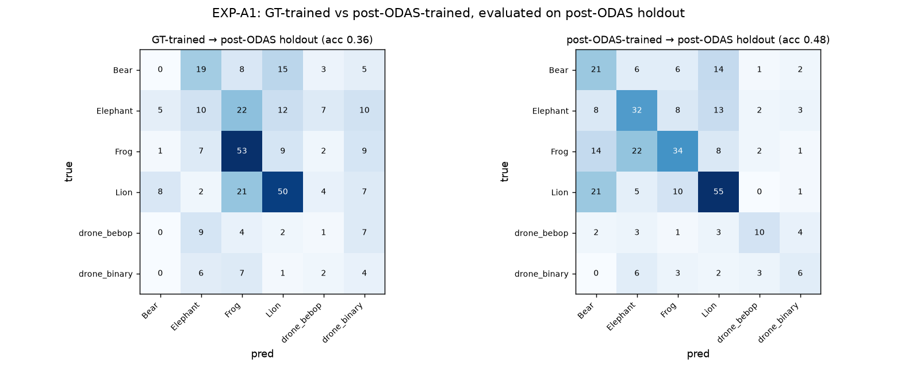

# Phase 1 · EXP-A1 — Track B (post-ODAS): FP/min + GT-vs-ODAS comparison

**experiments.pdf tag:** `exp_a1_no_ambient`. This completes EXP-A1 with the **real ODAS
pipeline** (`odaslive` in the arm64 container — see [`ODAS_BRINGUP.md`](ODAS_BRINGUP.md)),
producing the metrics that Track A ([`P1_exp_a1.md`](P1_exp_a1.md)) could not: **FP/min** and the
**post-ODAS** training arm.

## What ran (full Track-B chain)

```
600s render ─► odaslive (sim_mode) ─► 643 .bin + session JSON
                    │
   analyzer (match to GT, 15°) ──► FP/min, event recall, per-match table
                    │
   .bin spectra ─► mel ─► YAMNet core embeddings ─► train head (post-ODAS)
                                                          │
   300s holdout ─► odaslive ─► analyzer ─► post-ODAS holdout ◄── eval BOTH heads
```

Scripts: `expA1_analyze.py` (drives the real `analyzer.py` headless; computes metrics
transparently), `expA1_compare.py` (GT-trained vs post-ODAS-trained, both on post-ODAS holdout).

## Result 1 — ODAS detection & false positives

| Metric | 600 s train render | 300 s holdout |
|---|---|---|
| GT events detected (recall) | 80/90 = **0.889** | 58/60 = **0.967** |
| Avg angular error | 4.8° | — |
| **FP/min (detections in quiet periods)** | **22.0** | **18.7** |

- **ODAS detects real events well** (89–97% recall, ~5° DOA error) — localization/tracking work.
- **False positives are the dominant problem: ~20/min even with zero ambient.** These are the
  structural GCC-PHAT ghost tracks the PDF flagged. **This is the binding deployment constraint,
  and it is not a YAMNet-capacity issue** — it's SST tuning + hard-negative training (EXP-B4).
  - **Refined:** ~⅓ of these are a free-to-remove null/zero-activity DOA artifact; the honest
    *deployed* baseline (with `min_activity` filtering) is **~8–11 FP/min**, still ~4–5× over the
    ≤2 target. Full root-cause breakdown (it's SSL/array geometry, not Kalman; and why we don't
    mask directions) in [`P1_fp_cause_analysis.md`](P1_fp_cause_analysis.md).

> ⚠️ **Caveat:** the SST config used the repo's template defaults, **not** the PDF's tuned
> "Balanced" preset (`N_prob=6, theta_prob=0.65, Pnew=0.06`). FP/min is highly preset-sensitive
> (cf. EXP-C3), so treat ~20/min as "template-default SST," not the PDF's ≤2 target. Event recall
> and the GT-vs-ODAS comparison below are robust to this.

## What counts as a False Positive (precise definition)

**FP = a *classified* ODAS detection emitted during a window when *no* ground-truth source is
active anywhere.** ODAS tracked a peak, YAMNet attached a class label, and there was no real sound
at that moment — a ghost track that would have fired an alert in silence. `FP/min = (# such
detections) ÷ (quiet minutes)`, where *quiet* = time outside the union of all GT source
[start,end] intervals.

It is computed transparently in `expA1_analyze.py` (not the curator's function). Decomposition of
the 300 s holdout's **443** classified detection emissions:

| bucket | count | counted as FP? |
|---|---|---|
| matched a GT source (direction + time) | 332 | no — true detection |
| **unmatched, in a quiet period (no GT active anywhere)** | **51** | **yes — FP/min** |
| unmatched, during an active period (GT sounding elsewhere, peak points the wrong way) | 60 | no (separate localization error) |

So there are three distinct error types; **FP/min captures only the first**:
1. **Quiet-period ghost** (no source anywhere) — counted.
2. **Wrong-direction-while-active** (a real source exists, this peak is spurious) — *not* counted
   here; it's a localization error during active time.
3. **Right detection, wrong class** (matched a source but YAMNet mislabels) — a classification
   error, lives in the confusion matrix, not in FP/min.

Two properties of the count:
- **Granularity ≈ per spurious track.** The 51 quiet emissions came from **50 distinct ghost
  track ids** (quiet ghosts are short-lived, ~1 emission each), so FP/min ≈ *distinct spurious
  tracks per minute* ≈ "spurious alerts/min" — the deployment-meaningful unit.
- **Already gated.** Raw SSL peaks that never receive a YAMNet class are filtered out *before*
  this count (the `no_class` gate — e.g. 4520 dropped in the 600 s run). FP/min therefore counts
  only ghosts that would actually trigger a classified alert.

**Scoping choice:** FP/min follows the PDF and counts only quiet-period ghosts (type 1). If
type-2 (wrong-direction-while-active) were also treated as FPs, the holdout count roughly doubles
(111 vs 51 — the "broad" unmatched-classified rate). Worth tracking both as the program proceeds.

## Result 2 — the core hypothesis: post-ODAS training transfers better

Both heads are fresh 6-class YAMNet heads (frozen backbone), evaluated on the **same post-ODAS
holdout** (the deployment distribution). Only the **training data** differs.

| Trained on | Holdout accuracy | Per-class F1 |
|---|---|---|
| **GT clips** (clean RIR, pre-beamform) | **0.355** | Bear **0.00**, drone_bebop 0.05, Elephant 0.17, Frog 0.54, Lion 0.55, drone_binary 0.13 |
| **post-ODAS** `.bin` spectra | **0.476** | Bear 0.36, Elephant 0.46, Frog 0.48, Lion 0.59, drone_bebop 0.49, drone_binary 0.32 |



- **+12 points** (0.355 → 0.476) from matching the training distribution to deployment —
  **the PDF's central hypothesis holds.**
- The GT-trained model **collapses** on classes whose post-beamform signature differs most
  (Bear F1 0.00, drone_bebop 0.05): the domain gap is real and severe.
- The post-ODAS model is **non-trivial on all six** classes (clean diagonal in the right panel).

## Result 3 — the deployed model is stale (incidental but important)

The model in `chatak-odas/models/` is the **4-class** `fixed-ambient-ele-fg-dr`
(Elephant/Frog/background/drone_bebop). On the 6-class scene it scored 0.19 "class accuracy"
because Lion/Bear/drone_binary are **not in its label set** — every such event is forced to a
wrong class. Re-deploy a 6-class model before any live class-accuracy claim.

## Are we moving toward the goal, or is YAMNet not working?

**Moving toward the goal — with a clear, redirected priority:**
- YAMNet **classification is learnable** on post-ODAS spectra and **improves with the right data**
  (post-ODAS > GT, all classes non-zero). It is *not* the blocker.
- The blocker is **false positives (~20/min)** — an ODAS-SST + hard-negative-training problem.
- **Absolute accuracy (0.48) is still modest** — driven by small data (416 post-ODAS train clips)
  and the genuinely hard beamformed/reconstructed domain. Not "YAMNet won't work," but "needs
  more post-ODAS data + hard negatives + per-class thresholds" before deployment-grade.

## Recommended next steps (re-prioritized by these results)

1. **EXP-B4 hard negatives first** — render ambient-only scenes → ODAS → label ghost tracks
   `background`, retrain. Directly attacks the 20/min FP rate (the binding constraint).
2. **SST "Balanced" preset** — apply the PDF's tuned `N_prob/theta_prob/Pnew` and re-measure
   FP/min (EXP-C3) — likely the fastest large FP reduction.
3. **More post-ODAS data + per-class thresholds** (EXP-C2) to lift the 0.48 and protect Bear/drone.
4. Re-deploy a 6-class model so live class metrics are meaningful.

## Artifacts

`experiments/outputs/`: `a1_deploy_metrics.json`, `a1_hold_deploy_metrics.json`,
`a1_matches.json` (416), `a1_hold_matches.json` (332), `expA1_compare.json`,
`figures/expA1_gt_vs_odas.png`. ODAS logs: `experiments/odas/logs_a1/`, `logs_hold/`.

## Reproduce

```bash
# (odaslive already built — see ODAS_BRINGUP.md)
# 1. stream renders through ODAS (sim_mode) → logs_a1/ , logs_hold/   [docker run ...]
# 2. analyze:
.venv/bin/python experiments/scripts/expA1_analyze.py --logs experiments/odas/logs_a1 \
    --scene experiments/sim/scenes/exp_a1_no_ambient.json --tag a1
.venv/bin/python experiments/scripts/expA1_analyze.py --logs experiments/odas/logs_hold \
    --scene experiments/sim/scenes/exp_a1_holdout.json --tag a1_hold
# 3. compare:
.venv/bin/python experiments/scripts/expA1_compare.py \
    --gt-dataset experiments/sim/gt_datasets/gt_datasets/gt_a1_no_ambient \
    --odas-train experiments/outputs/a1_matches.json \
    --odas-holdout experiments/outputs/a1_hold_matches.json
```
