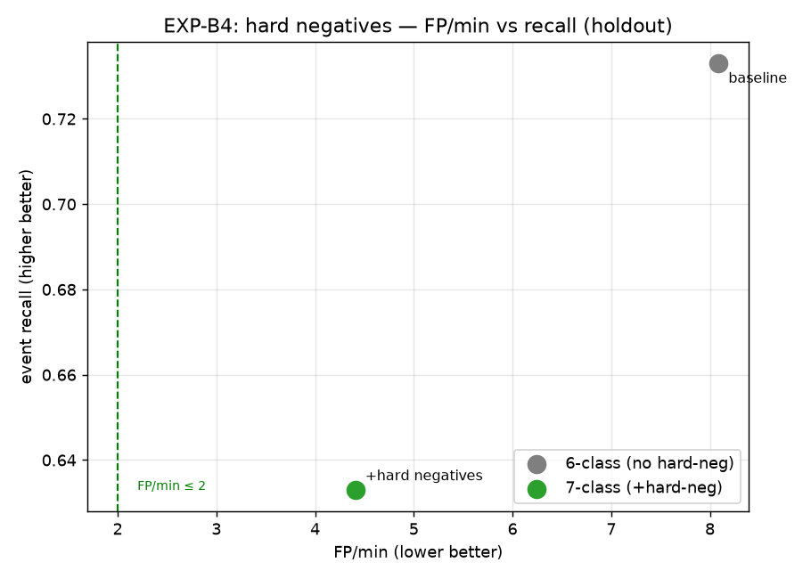

# Phase 2 · EXP-B4 — Hard Negatives (reject ghosts by spectrum)

**experiments.pdf tag:** `exp_b4_hard_negatives`. **Goal:** reduce the structural false positives
([`P1_fp_cause_analysis.md`](P1_fp_cause_analysis.md)) by teaching the model that ghost-track
spectra are `background` — the only fix that's **direction-agnostic** (keeps real sources at
hotspot bearings) and that the config-only levers couldn't deliver without wrecking recall.

## Method (leakage-free)

The structural ghosts we already captured *are* the hard negatives — no new render needed:
- **Hard negatives:** quiet-period, non-null ghost `.bin` spectra from the **600 s** render (80).
- **Positives:** the 600 s GT-matched detections (416, 6 classes).
- Train two heads on post-ODAS YAMNet embeddings: **6-class** (positives only) vs **7-class**
  (+ `background`). Evaluate both on the **300 s holdout's** ghosts (different render → no leakage).
- FP/min = holdout quiet-ghosts classified as a **non-background** class (a ghost that still fires
  an alert). Recall = GT events with ≥1 matched detection classified as the correct animal.

## Result (holdout, votes≥1, null-activity filtered)

| model | FP/min | event recall | ghosts → background |
|---|---|---|---|
| 6-class (no hard-neg) | 8.1 | 0.733 | 0 / 22 |
| **7-class (+80 hard-neg)** | **4.4** | 0.633 | **10 / 22** |



## Findings

- **Hard negatives work directionally: FP/min 8.1 → 4.4 (−45%)** by routing 10/22 holdout ghosts
  to `background`. This is the **only lever so far that attacks ghosts by spectrum** — `probMin`
  did nothing, and unlike a vote gate it doesn't blanket-suppress short events.
- **But recall also dropped (0.73 → 0.63)** and it did **not** reach the ≤2 target. Two reasons,
  both pointing at *too few / too narrow* hard negatives:
  1. **Under-generalization:** 12/22 holdout ghosts still fired — the `background` manifold learned
     from 80 ghosts (at the 600 s render's hotspot bearings/spectra) didn't cover all the holdout's
     ghost spectra.
  2. **Over-triggering:** some weak/quiet real events (spectrally near the ghosts) got pulled into
     `background` → the recall loss.

## Comparison of all FP levers (holdout)

| lever | FP/min | recall | note |
|---|---|---|---|
| none (6-class, votes≥1) | 8.1 | 0.73 | baseline |
| `probMin` 0.7–0.8 | 9.2 | 0.93→0.60 @v2 | ineffective ([sweep](P1_fp_cause_analysis.md#config-lever-sweep-results-empirical--holdout-null-activity-filtered)) |
| `min_event_votes ≥ 2` | 0.7 | 0.65 | best FP, but blunt (kills short events) |
| **hard negatives (80)** | **4.4** | **0.63** | spectrum-based, direction-agnostic, **data-limited** |

## Verdict (re: the goal)

**B4 is the right mechanism but needs more data.** With only 80 hard negatives it halves FP without
the systematic short-event loss of a vote gate, yet doesn't hit target and costs some recall. The
result says: scale the hard negatives and the background class should generalize better and stop
stealing real events.

## Next steps (ranked)

1. **Collect many more hard negatives** — run a **dedicated ambient-only scene** (0 directional
   sources, long duration, High-Recall SST to harvest *all* ghosts) → hundreds–thousands of
   `background` spectra spanning all hotspot bearings. This is the proper PDF B4 ambient-only
   pipeline; our 80-from-a-side-channel was a fast proxy.
2. **Background-confidence threshold** — only suppress when `P(background)` is high, to stop the
   class stealing borderline real events (recover recall).
3. **Stack levers** — hard negatives + Low-FP SST preset + a *mild* vote gate (≥2 only for classes
   that aren't short/quiet), so each removes a different ghost slice.
4. **More positives for short/quiet classes** (Bear, Frog, drone) so they're not the easiest to
   confuse with background.

## At scale with REAL ambient — and a critical methodological finding

We then harvested **773 hard negatives from a real capture** (Eco_Park, 600 s of urban-park
ambient — traffic/children/wind) streamed straight through ODAS (ambient-only, High-Recall). On
the same holdout:

| negatives | FP/min | recall | holdout ghosts → background |
|---|---|---|---|
| none (6-class) | 8.1 | 0.68 | 0 / 22 |
| 80 **structural** ghosts | **4.4** | 0.63 | **10 / 22** |
| 773 **real-ambient** | 7.4 | 0.62 | **2 / 22** |

**The real-ambient negatives barely helped — and did *worse* than 80 structural ghosts.** Why:
**a distribution mismatch.** Our holdout is a *no-ambient* synthetic render, so its false positives
are **structural/numerical SSL artifacts** (array hotspots firing on near-silence). The 80
structural ghosts match that distribution → catch 10/22. Real-ambient negatives teach the model
about *traffic/children/wind* spectra — a **different** failure mode → they catch only 2/22.

### Why this matters more than the FP number

It means **our entire FP analysis so far (A1, SST sweep, FP cause, this B4) has been measuring the
wrong FP distribution for deployment.** In the field the device runs on *real ambient*, so real
deployment false positives are **real-ambient sounds misclassified as animals** — exactly what the
773 negatives target — **not** the silent-render structural artifacts our synthetic holdout
measures. The structural-ghost result looks better here only because the synthetic holdout is made
of structural ghosts.

### Corrected plan

To measure and fix **deployment-relevant** false positives, the scenes must contain real ambient:

1. **Run EXP-A5 properly** — render train + holdout scenes as *directional sources + real-capture
   ambient* (`ambient_mode='capture'`, header-stripped raws — the renderer supports it). Now the
   holdout FPs are real-ambient-driven.
2. **Then B4 with real-ambient negatives should transfer** (matched distributions), and we can
   measure the FP/min that actually predicts field behavior.
3. Keep a *small* structural-ghost set too — the silent-array artifacts still occur on the Pi
   during true silence, so both negative types belong in training.

This is the single most important course-correction in Phase 1/2, and it came directly from the
"did you use the raw files as ambient?" question — the answer (no, everything was no-ambient
synthetic) exposed that our FP testbed wasn't deployment-representative.

## Artifacts / reproduce

`experiments/outputs/expB4_results.json`, `figures/expB4_hard_negatives.png`.
```bash
.venv/bin/python experiments/scripts/expB4_hard_negatives.py
```
(uses `a1_analysis.pkl` train ghosts + `a1_hold_analysis.pkl` holdout ghosts.)
