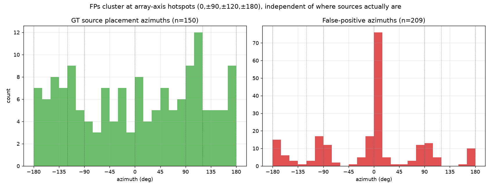
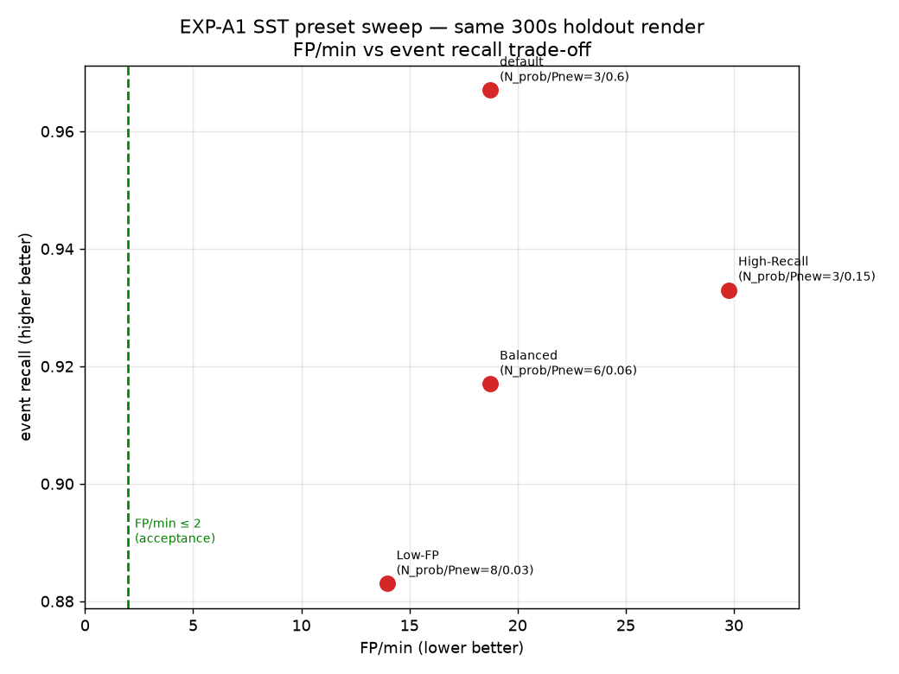
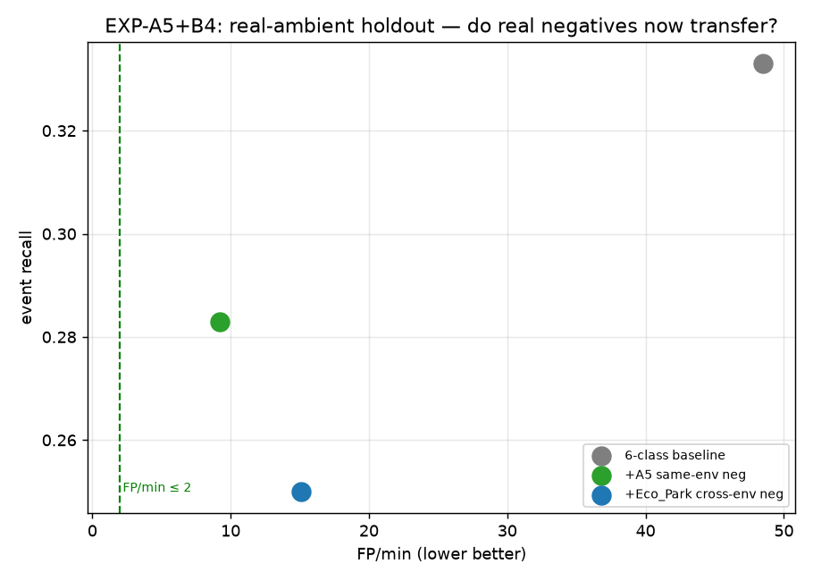
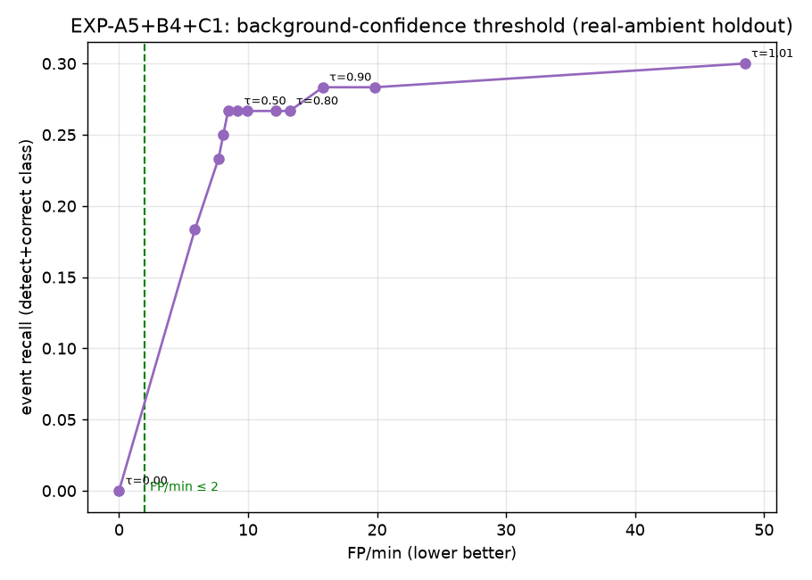

# Chatak Acoustic Monitoring — Full Project Report

## 1. What we're building and why

**Chatak** is a wildlife acoustic-monitoring device: a **ReSpeaker 4-mic array** on a
**Raspberry Pi** runs **ODAS** (localise + track sound) with an embedded **YAMNet** neural network
(classify sound) to detect animals and threats — *what* sound, *from which direction* — and emit
alerts. Targets here: **Elephant, Lion, Bear, Frog, drone (bebop/binary)**.

**The goal of this work:** improve classification accuracy and **reduce false positives** so the
device is trustworthy in the field. Two questions drove everything:

1. Is **YAMNet** the right brain for this — can it tell our animals apart?
2. Why does the device **fire false alarms**, and how do we stop them without missing real animals?

**How we test without a forest:** a **simulator** places known sounds at known directions/times in
a virtual room, renders what the mic array would hear, and runs it through the *real* ODAS
firmware. Because we know the ground truth, we can score detection and false positives exactly.

```
 mic array → SSL (direction) → SST (tracking) → YAMNet (classify) → "Elephant @ 90°"
                                                       ▲
                         simulator generates realistic mic audio with known answers
```

---

## 2. The data

We built a clean, labelled inventory first ([details](01_data_prep.md)):

- **450 one-second clips, 16 kHz**: 50 each of Elephant, Drone, Lion, Monkey, Frog + 200 background.
- Standardized, de-duplicated, source-level train/test split (no leakage), with SNR/quality scoring.

**Finding:** every target class sits 20–40 dB above the background floor and forms clean clusters —
the raw audio is separable. (Background was extracted from real mic-array captures.)

---

## 3. Part 1 — Is YAMNet the right brain? (clean-clip experiments)

We ran the `plan.md` warm-up: does YAMNet's internal representation separate our classes?

| Leg | Question | Result |
|---|---|---|
| [L1](L1_yamnet_baseline.md) | Does raw YAMNet recognise our sounds? | **No** — Elephant→"Jackhammer", Frog→"Eruption"; 0–12 % relevant. Its 521 generic labels don't include our animals. |
| [L2](L2_embedding_viz.md) | Do the sounds cluster in YAMNet's *embedding* space? | **Yes** — k-NN purity 0.80; 4/5 classes form clean clusters. |
| [L3](L3_linear_probe.md) | Can a simple classifier on those embeddings work? | **Yes, near-perfect** — AUC 0.90–1.00. |
| [L4](L4_mlp_head.md) | Does a fancier (non-linear) classifier help? | **No** — already at ceiling; the bottleneck is data, not the model head. |


**Conclusion of Part 1:** YAMNet's **embedding space is excellent** for our classes. Only the
*output head* needs retraining to our labels — no deep surgery. This is the easy, encouraging
result. **But these are clean clips** — the real test is what the device hears after ODAS in the
field, which Part 3 tackles.

---

## 4. Part 2 — Standing up the real pipeline

To measure deployment behavior we needed the actual **ODAS firmware** running. It targets Linux +
an ARM TensorFlow-Lite library; this is an Apple-Silicon Mac. Solution: an **arm64 Linux Docker
container**, which matches the Raspberry-Pi target exactly, so the bundled Pi TFLite library works
unchanged ([build details](ODAS_BRINGUP.md)).

We built `odaslive`, fed it a rendered scene over a socket, and confirmed the full chain produces
detections + per-event spectra (`.bin`) + classifications. **The simulator→ODAS→YAMNet loop runs
end-to-end on this machine.** (One cosmetic bug: ODAS segfaults on shutdown *after* writing all
output — harmless for batch runs.)

---

## 5. Part 3 — The deployment experiments

### 5.1 First measurement (EXP-A1): does post-ODAS training help, and how bad are false positives?

We rendered a 600 s scene (no ambient), ran it through ODAS, and trained two models — one on
**clean** clips, one on **post-ODAS** clips (what the device actually hears) — testing both on a
held-out render ([details](P1_exp_a1_trackB.md)).

| Finding | Value |
|---|---|
| ODAS detects real events | **89 %** recall, 4.8° direction error — good |
| Post-ODAS training beats clean training | **0.48 vs 0.36** accuracy on the deployment holdout ✓ |
| **False positives** | **~20 / min** even with **no ambient at all** |

**Two lessons:** (1) training on post-ODAS data transfers better — the PDF's core hypothesis holds;
(2) false positives, not classification, are the dominant problem.

### 5.2 What causes the false positives? (it's not the tracker)

We diagnosed the false alarms carefully ([details](P1_fp_cause_analysis.md)).



- **They cluster at fixed array directions** (0°, ±90°, ±120°, ±180°) — the **mic-array geometry**,
  not random tracker noise. ~87 % fall on those axes.
- **~⅓ are a null/zero-energy artifact** (a placeholder direction emitted in silence) — *free* to
  filter, no recall cost. The honest "deployed" baseline after that filter is **~8–11 FP/min**.
- **It is not the Kalman tracker** — tightening it barely helped (next section), and the
  geometry-locked pattern rules it out.

### 5.3 Can we fix it by tuning ODAS? (partly, but not enough)

We swept the tracker presets and the localization confidence floor on identical audio
([SST sweep](P1_sst_sweep.md), [config sweep](P1_fp_cause_analysis.md#config-lever-sweep-results-empirical--holdout-null-activity-filtered)).



| Lever | Effect on FP/min | Verdict |
|---|---|---|
| SST presets (Balanced/Low-FP/High-Recall) | 18.7 → best 14.0 | ~25 %, **insufficient** |
| `ssl.probMin` ↑ (0.5→0.8) | 8.1 → 9.2 (worse) + recall loss | **ineffective** (hotspots are *strong* peaks) |
| `min_event_votes ≥ 2` | 8.1 → **0.7** | hits target **but recall 0.97→0.65** — too blunt (kills short animals) |

**Conclusion:** ODAS config tuning can reach the false-positive target *only* by throwing away ~⅓
of real detections. It's a complement, not the fix.

### 5.4 The fix: teach the model to ignore ghosts (EXP-B4 hard negatives)

Idea: label the ghost spectra as **`background`** so the model rejects them *by sound*, not by
direction (so real animals at any direction survive — [details](P2_exp_b4.md)). On the no-ambient
holdout it cut FP 8.1 → 4.4. **But** real-recording negatives barely helped there (2/22) — which
exposed the single most important issue of the project.

### 5.5 The turning point: we were measuring the wrong false positives

Our no-ambient scenes' "quiet" was **literal digital silence (−97 dBFS)**, so the false positives
were *structural artifacts of silence* — **not** what a device hears in a real, noisy environment.
In the field, false positives come from **real ambient sound** (traffic, wind, birds) mistaken for
animals. We had never put real ambient into the scenes.

### 5.6 The realistic testbed (EXP-A5): real ambient changes everything

We re-rendered scenes with **real mic-array captures mixed in as ambient** ([details](P1_exp_a5.md)).

| Testbed | FP/min | recall |
|---|---|---|
| No ambient (the old, misleading baseline) | 18.7 | 0.9 |
| **Real ambient (deployment-realistic)** | **51** | 0.62 |

Real ambient = **2–3× the false positives and ~30 pts less recall.** The earlier numbers were
optimistic artifacts. **Now**, do hard negatives work?



| Model (on real-ambient holdout) | FP/min | ghosts suppressed |
|---|---|---|
| no hard negatives | 48.5 | 0 / 132 |
| **+ same-environment negatives** | **9.2** | **107 / 132 (81 %)** |
| + different-environment negatives | 15.1 | 91 / 132 (69 %) |

**Hard negatives cut false positives 81 %** on the realistic testbed — the *opposite* of what they
did on the silent one. This is direct proof: **the testbed, not the method, was the problem.**
Same-environment negatives work best, but different-environment negatives still help a lot
(rejection generalizes across recording sites).

### 5.7 The remaining wall: classification accuracy in noise

With false positives controllable, the binding constraint is now **recall**: how often we both
*detect* and *correctly classify* a real animal in heavy ambient. We swept a background-confidence
threshold to trade FP against recall ([data](P1_exp_a5.md)):



**Recall is capped at ~0.30 no matter the threshold** — there is no setting that reaches FP ≤ 2
*and* useful recall. In ~5 dB-SNR ambient the post-ODAS spectra are simply hard to classify. This
is a data/SNR problem, not something a threshold can fix.

---

## 6. Conclusions

1. **YAMNet is the right brain.** Its embeddings cleanly separate our classes (Part 1); only the
   output head needs retraining. No backbone surgery.
2. **Train on what the device hears.** Post-ODAS (beamformed) training beats clean-audio training
   on the deployment distribution (0.48 vs 0.36).
3. **False positives are an array-geometry + classifier problem, not the tracker.** They cluster on
   the mic-array axes; ~⅓ are a free-to-filter null artifact.
4. **ODAS config tuning is necessary hygiene but insufficient** — it only hits the FP target by
   destroying recall.
5. **Hard negatives are the real false-positive fix** — and *direction-agnostic*, so they keep real
   animals at every bearing. On a realistic testbed they cut FP **81 %** (48.5 → 9.2/min).
6. **Measure on real ambient.** The biggest mistake we caught: silent-render false positives are
   structural artifacts and *do not* represent field behavior. Real ambient is 2–3× worse and is
   the only valid testbed.
7. **The current wall is classification accuracy in heavy ambient** (~0.30 correct-class at ~5 dB
   SNR). No threshold trick fixes it.

**Is YAMNet working / are we moving toward the goal?** Yes — the representation is right, the
false-positive problem now has a working, validated fix (hard negatives on real ambient), and we
have an honest deployment-realistic measurement. The remaining gap is recall in noise, with a clear
path to close it.

---

## 7. What to do next (prioritized by the evidence)

1. **Improve SNR / detection in ambient** — the binding constraint. Louder/closer source scenes,
   more post-ODAS training data per class, and ambient-mixed positives across multiple captures.
2. **Scale hard negatives across environments (EXP-B5)** — pool ghosts from several real captures
   for site-robust false-positive rejection; keep a small structural-ghost set for true silence.
3. **Add a background-confidence threshold** in deployment to tune the FP/recall operating point
   per use case.
4. **Re-deploy a current 6-class model** (the firmware currently carries a stale 4-class model).
5. **Fix the ODAS shutdown segfault** before long-running live capture.

---

## 8. Experiment scorecard

| # | Experiment | Headline result | Doc |
|---|---|---|---|
| Data | Clip inventory | 450 clips, classes separable | [01](01_data_prep.md) |
| L1–L4 | YAMNet on clean clips | embeddings excellent (AUC ~1.0); head needs retrain | [L0](L0_plan_results.md) |
| infra | ODAS bring-up | built + running in arm64 Docker | [ODAS](ODAS_BRINGUP.md) |
| A1 | Post-ODAS vs clean, FP | post-ODAS wins 0.48 vs 0.36; ~20 FP/min | [A1·B](P1_exp_a1_trackB.md) |
| A1·FP | FP root cause | array geometry (not Kalman); ⅓ free artifact | [FP](P1_fp_cause_analysis.md) |
| A1·SST | Config tuning | Low-FP 14/min — insufficient | [SST](P1_sst_sweep.md) |
| B4 | Hard negatives | works by spectrum; testbed mismatch exposed | [B4](P2_exp_b4.md) |
| A5 | Real-ambient testbed | 51 FP/min real; hard negs cut to **9.2 (−81 %)** | [A5](P1_exp_a5.md) |
| C1 | Background threshold | recall capped ~0.30 — classification is the wall | [A5](P1_exp_a5.md) |

*All raw numbers, scripts, and figures: `experiments/outputs/` and `experiments/scripts/`.
Pipeline internals: step docs [00](00_overview.md)–[08](08_deployment_and_loop.md).*
